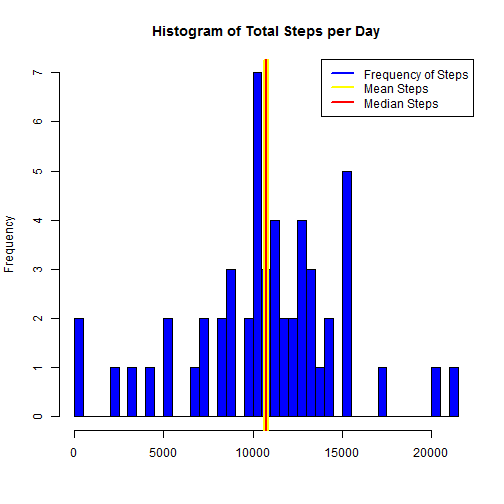
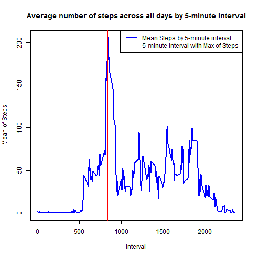
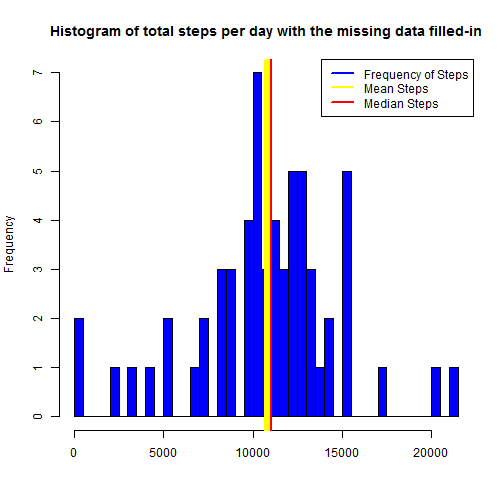
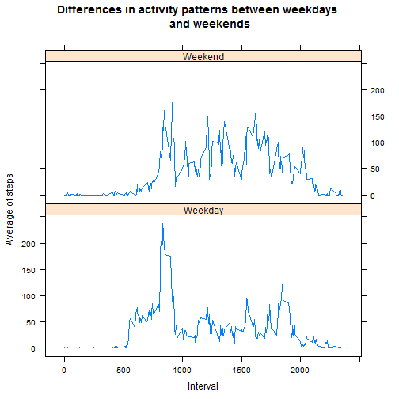

## Loading and preprocessing the data
Once there is a zipped archive located in the working directory, firstly it will be unzipped and after load it into a object (called `database`).  
Secondly we convert the second column as date and add a new column with weekday abbreviated.  
And finally I will create two subsets that will be use to answer the next questions:  
Subset 1: Considered without NA values (called `base`);  
Subset 2: Considered with NA values (called `baseNA`).


```r
# Unzip the base
unzip("activity.zip", overwrite = TRUE)

# Load the base
database <- read.csv("./activity.csv")

# I'm using this comand because my RStudio is configured in portuguese
Sys.setlocale("LC_TIME", "English")
```

```
## [1] "English_United States.1252"
```

```r
# Convert the second column as date
database[,2]<-as.Date(database[,2],"%Y-%m-%d")

# Add new column as weekday abbreviated
database[4] =format(database[,2], "%a")
names(database)[4] <- "weekday"

# Subset 1: without NA values
base <- database[!is.na(database[,1]),]

# Subset 2: with NA values
baseNA <- database[is.na(database[,1]),]

# Show five-first values of Subset 1
head(base, n=5)
```

```
##     steps       date interval weekday
## 289     0 2012-10-02        0     Tue
## 290     0 2012-10-02        5     Tue
## 291     0 2012-10-02       10     Tue
## 292     0 2012-10-02       15     Tue
## 293     0 2012-10-02       20     Tue
```


## What is mean total number of steps taken per day?
Using the subset 1 (without NA values), we can summarize the sum of steps by date (called `base1q`), make an histogram of total steps and then find out the mean and median per day.

```r
# Suppress scientific notation
options(scipen = 1, digits = 5)

# Summarize the steps by date
base1q <- aggregate(base[,1], by = list(Date = base[,2], 
        Weekday = base[,4]), FUN = sum)
names(base1q)[3] <- "Total"

# find out the mean and median
meanSteps <- mean(base1q[,3])
medianSteps <- median(base1q[,3])
```

1. Histogram of the total number of steps taken by each day.  
2. The mean is 10766.18868 (the yellow line on the plot) and the median is 10765 (the red line on the plot).

```r
# Plot 1
hist(base1q$Total, breaks = nrow(base1q), col = "blue",
     main = "Histogram of Total Steps per Day", xlab="")
abline(v = meanSteps, col = "yellow", lwd = 6)
abline(v = medianSteps, col = "red", lwd = 2)
legend("topright", lty=1, lwd=2, cex=1, col = c("blue","yellow","red"), 
       legend = c("Frequency of Steps","Mean Steps", "Median Steps"))
```

 


## What is the average daily activity pattern?
To answer this question, using the subset 1, we will summarize the average of steps by 5-minute interval (called `base2q`) and define the maximum number of steps (called `MaxInterval`).

```r
# Summarize the steps by interval
base2q <- aggregate(base[,1], by = list(Interval = base[,3]), FUN = mean)
names(base2q)[2] <- "MeanSteps"

# Find out maximum number of steps across all interval
MaxInterval <- base2q[base2q[,2] == max(base2q[,2]),]

# Show five-first values of base2q
head(base2q, n=5)
```

```
##   Interval MeanSteps
## 1        0  1.716981
## 2        5  0.339623
## 3       10  0.132075
## 4       15  0.150943
## 5       20  0.075472
```

1. Time serial plot of the 5-minute interval and the average number of steps taken across all days.  
2. The 5-minute interval which contains the maximum number of steps is 835 (the red line on the plot) and its value is 206.16981.

```r
# Plot 2
plot(base2q$Interval, base2q$MeanSteps, type="l", 
     main = "Average number of steps across all days by 5-minute interval",
     xlab="Interval", ylab="Mean of Steps")
lines(base2q$Interval, base2q$MeanSteps, type="l", col="blue", lwd=2)
abline(v = MaxInterval[,1], col = "red", lwd = 2)
legend("topright", lty=1, lwd=1, cex=1, col = c("blue","red"), 
       legend = c("Mean Steps by 5-minute interval", 
                  "5-minute interval with Max of Steps"))
```

 


## Imputing missing values
In the original base, there are some missing values coded as NA only in `step` variable. These missing values were separated in the subset 2 at the beginning.  
In order to identify the impacts, I will summarize this subset 2 by date to see how it is distributed (called `base3q`).  
Besides it, I will check how many dates have NA values (`countDates`) and the amount of observations with NA values (`countNAvalues`).

```r
# Distribution of NA values
base3q <- aggregate(baseNA[,2], by = list(Date = baseNA[,2], 
        Weekday = baseNA[,4]), FUN = length)
names(base3q)[3] <- "Count"

# Total of dates with NA values in 'step' variable
countDates <- length(unique(baseNA[,2]))

# Total of observations with NA values in 'step' variable
countNAvalues <- nrow(baseNA)
```


```r
print(base3q)
```

```
##         Date Weekday Count
## 1 2012-11-09     Fri   288
## 2 2012-11-30     Fri   288
## 3 2012-10-01     Mon   288
## 4 2012-10-08     Mon   288
## 5 2012-11-10     Sat   288
## 6 2012-11-04     Sun   288
## 7 2012-11-01     Thu   288
## 8 2012-11-14     Wed   288
```
1. The total of observations with NA values is 2304. This total is distribute in 8 dates. Above we can check this distribution.  
2. In order to replace the missing values, I decided to use the average number of steps by 5-minute interval and weekday. To define these average, I will create a subset `base4q`.  
3. Now we'll create a new dataset that is equal to the original dataset but with the missing data filled in (called `database2`).

```r
# Create a subset with the average by 5-minute interval and weekday
base4q <- aggregate(base[,1], by = list(Interval = base[,3], Weekday = base[,4])
        , FUN = mean)
names(base4q)[3] <- "MeanSteps"

# Merge database and base4q in order to identify the correspond average value 
# for each combination of 5-minute interval + Weekday within base4q
database2 <- merge(database, base4q, by.x =c("interval","weekday"), 
                   by.y=c("Interval","Weekday"), sort =F)

# Create a vector where NA values can be changed for the average value and keep
# the others
valid <- ifelse(is.na(database2[,3]), database2[,5], database2[,3])

# Replace the steps value with NA for the vector "valid" which has the changed values
database2[,3] <- valid

# Reorder the variables and sort the observations by date and interval
database2 <- database2[order(database2[,4], database2[,1]),c(3, 4, 1, 2, 5)]

# Here is just to check the original base with NA values
# Show five-first values
head(database, n=5)
```

```
##   steps       date interval weekday
## 1    NA 2012-10-01        0     Mon
## 2    NA 2012-10-01        5     Mon
## 3    NA 2012-10-01       10     Mon
## 4    NA 2012-10-01       15     Mon
## 5    NA 2012-10-01       20     Mon
```

```r
# And here after changing NA values
# Show five-first values
head(database2[,-5], n=5)
```

```
##     steps       date interval weekday
## 1  1.4286 2012-10-01        0     Mon
## 12 0.0000 2012-10-01        5     Mon
## 21 0.0000 2012-10-01       10     Mon
## 28 0.0000 2012-10-01       15     Mon
## 37 0.0000 2012-10-01       20     Mon
```
4. Histogram of the total number of steps taken by each day with NA replacement:

```r
# Summarize the steps by date
base5q <- aggregate(database2[,1], by = list(Date = database2[,2], 
        Weekday = database2[,4]), FUN = sum)
names(base5q)[3] <- "Total"

# find out the mean and median
meanSteps2 <- mean(base5q[,3])
medianSteps2 <- median(base5q[,3])

# Plot 3
hist(base5q$Total, breaks = nrow(base5q), col = "blue",
     main = "Histogram of total steps per day with the missing data filled-in", xlab="")
abline(v = meanSteps2, col = "yellow", lwd = 6)
abline(v = medianSteps2, col = "red", lwd = 2)
legend("topright", lty=1, lwd=2, cex=1, col = c("blue","yellow","red"), 
       legend = c("Frequency of Steps","Mean Steps", "Median Steps"))
```

 


## Are there differences in activity patterns between weekdays and weekends?
To check the differences, using the base with missing values filled-in (`database2`), I will create a subset (called `database3`), add a new column (`classday`) with the definition of weekday or weekend and then summarize it by 5-minute interval + classday (called `base6q`).

```r
# Create a new data frame with the weekday or weekend definition
database3 <- cbind(database2[,-5], ifelse(database2[,4] == "Sat" | 
        database2[,4] == "Sun", "Weekend", "Weekday"))
names(database3)[5] <- "classday"

# Summarize the steps by interval
base6q <- aggregate(database3[,1], by = list(Interval = database3[,3], 
        ClassDay = database3[,5]), FUN = mean)
names(base6q)[3] <- "MeanSteps"

# Show five-first values
head(base6q, n=5)
```

```
##   Interval ClassDay MeanSteps
## 1        0  Weekday  2.310714
## 2        5  Weekday  0.450000
## 3       10  Weekday  0.175000
## 4       15  Weekday  0.200000
## 5       20  Weekday  0.088889
```

```r
# Comparative between weekday-average and weekend-average
comparative <- aggregate(base6q[3], by = list(base6q[,2]), FUN = mean)
print(comparative)
```

```
##   Group.1 MeanSteps
## 1 Weekday    35.616
## 2 Weekend    43.078
```
1. As we can see, the result shows that weekends are more intense. The total average of steps at weekdays is 35.61641 and at weekends is 43.07837.  
2. Time series plot of the 5-minute interval and the average number of steps taken, grouped by weekday days or weekend days.

```r
# Load the library
library(lattice)

# Plot 4
xyplot(MeanSteps ~ Interval | ClassDay, data = base6q, layout = c(1,2), 
       type = "l", main = "Differences in activity patterns between weekdays 
       and weekends", xlab = "Interval", ylab = "Average of steps")
```

 
